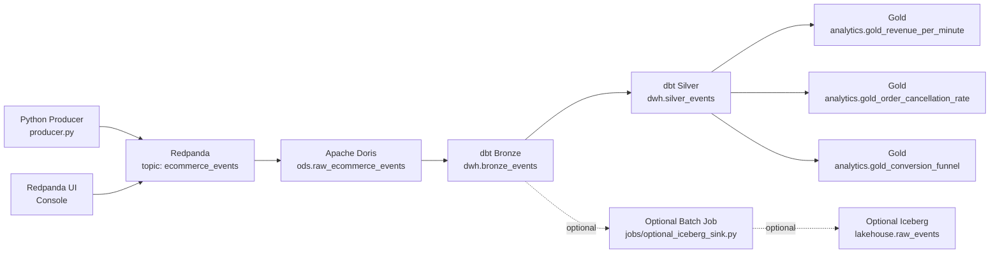

# Doris Streaming Medallion Demo

## Overview

This repository contains a Doris-focused, local-first medallion demo built with Docker Compose. It generates synthetic ecommerce events, publishes them to Redpanda, ingests them into Apache Doris through `ROUTINE LOAD`, and builds bronze, silver, and gold warehouse models with `dbt-doris`.

The implementation is optimized for a reproducible local demonstration rather than production completeness.

Mandatory data path:

`producer -> redpanda:ecommerce_events -> ods.raw_ecommerce_events -> dwh.bronze_events -> dwh.silver_events -> analytics.gold_*`

Optional path:

`dwh.bronze_events -> jobs/optional_iceberg_sink.py -> lakehouse.raw_events`

## Architecture



## Validated Status

The mandatory local demo path has been validated in the current workspace.

Validated components:

- Docker Compose stack startup
- Redpanda topic creation
- Producer message flow
- Doris raw ingestion via `ROUTINE LOAD`
- dbt bronze, silver, and gold model builds
- Gold metric queries

Validation details are recorded in [doc/validation-report.md](./data-stack/doc/validation-report.md).

## Prerequisites

- Docker Desktop or Docker Engine with Compose support
- At least 6 GB of Docker memory available
- A local shell with `docker compose`

Optional local tools:

- `mysql`
- `python3`

Notes:

- This project was validated on Docker Desktop using a Linux VM backend.
- On native Linux hosts, Doris may require a higher `vm.max_map_count` setting.
- On Docker Desktop for macOS, that setting is handled inside the Linux VM rather than on the macOS host directly.

## Repository Layout

- [docker-compose.yml](./docker-compose.yml)
- [sql/01_create_databases.sql](./sql/01_create_databases.sql)
- [sql/02_create_ods_tables.sql](./sql/02_create_ods_tables.sql)
- [sql/03_create_routine_load.sql](./sql/03_create_routine_load.sql)
- [sql/04_optional_iceberg.sql](./sql/04_optional_iceberg.sql)
- [sql/05_meta_checkpoint.sql](./sql/05_meta_checkpoint.sql)
- [producer/producer.py](./producer/producer.py)
- [dbt/dbt_project.yml](./dbt/dbt_project.yml)
- [dbt/tests/schema.yml](./dbt/tests/schema.yml)
- [jobs/optional_iceberg_sink.py](./jobs/optional_iceberg_sink.py)
- [doc/validation-report.md](./doc/validation-report.md)

## Quick Start

1. Copy the environment template.

```bash
cp .env.example .env
```

2. Start the full stack.

```bash
docker compose up -d
```

3. Confirm service status.

```bash
docker compose ps
```

Expected runtime services:

- `redpanda`
- `redpanda-ui`
- `doris-fe`
- `doris-be`
- `producer`
- `dbt-runner`
- `minio`
- `jobs`

## Redpanda Console

View topics, partitions, and schema metadata in Redpanda Console by browsing to `http://localhost:8081`.

Go to the *Topics* tab, filter for `ecommerce_events`, and click the topic to inspect partitions and consumer group activity. Console also lists the health of the Redpanda cluster on the home page.

## Verify Redpanda

List topics:

```bash
docker compose exec redpanda rpk topic list
```

Consume sample messages:

```bash
docker compose exec redpanda rpk topic consume ecommerce_events -n 5
```

Inspect producer logs:

```bash
docker compose logs --tail=100 producer
```

Open Redpanda UI:

- URL: `http://localhost:8081`
- Service: `redpanda-ui`

## Bootstrap Doris Objects

Run the SQL bootstrap scripts in this order:

```bash
docker compose exec -T doris-fe mysql -h 127.0.0.1 -P 9030 -u root < sql/01_create_databases.sql
docker compose exec -T doris-fe mysql -h 127.0.0.1 -P 9030 -u root < sql/02_create_ods_tables.sql
docker compose exec -T doris-fe mysql -h 127.0.0.1 -P 9030 -u root < sql/03_create_routine_load.sql
docker compose exec -T doris-fe mysql -h 127.0.0.1 -P 9030 -u root < sql/05_meta_checkpoint.sql
```

Optional Iceberg catalog bootstrap:

```bash
docker compose exec -T doris-fe mysql -h 127.0.0.1 -P 9030 -u root < sql/04_optional_iceberg.sql
```

Verify created Doris objects:

```bash
docker compose exec doris-fe mysql -h 127.0.0.1 -P 9030 -u root -e "SHOW DATABASES;"
docker compose exec doris-fe mysql -h 127.0.0.1 -P 9030 -u root -e "USE ods; SHOW TABLES;"
docker compose exec doris-fe mysql -h 127.0.0.1 -P 9030 -u root -e "USE meta; SHOW TABLES;"
```

Verify routine load status:

```bash
docker compose exec doris-fe mysql -h 127.0.0.1 -P 9030 -u root -e "USE ods; SHOW ROUTINE LOAD;"
```

## Verify Raw Ingestion

Check raw row count:

```bash
docker compose exec doris-fe mysql -h 127.0.0.1 -P 9030 -u root -e "SELECT COUNT(*) AS raw_count FROM ods.raw_ecommerce_events;"
```

Inspect recent raw rows:

```bash
docker compose exec doris-fe mysql -h 127.0.0.1 -P 9030 -u root -e "SELECT event_id, event_type, ingested_at FROM ods.raw_ecommerce_events ORDER BY ingested_at DESC LIMIT 10;"
```

## Run dbt

1. Create the dbt profile inside the mounted project directory.

```bash
docker compose exec dbt-runner sh -lc "cp -f profiles.yml.example profiles.yml"
```

2. Validate dbt connectivity.

```bash
docker compose exec dbt-runner dbt debug
```

Notes:

- `dbt debug` may report a missing `git` binary in the container.
- That warning does not prevent a working Doris connection.

3. Build all models.

```bash
docker compose exec dbt-runner dbt run
```

4. Execute tests.

```bash
docker compose exec dbt-runner dbt test
```

5. Apply demo role grants if required.

```bash
docker compose exec dbt-runner dbt run-operation grant_roles
```

## Query Warehouse Outputs

Bronze sample:

```bash
docker compose exec doris-fe mysql -h 127.0.0.1 -P 9030 -u root -e "SELECT * FROM dwh.bronze_events ORDER BY ingested_at DESC LIMIT 5;"
```

Silver sample:

```bash
docker compose exec doris-fe mysql -h 127.0.0.1 -P 9030 -u root -e "SELECT event_id, event_type, ingested_at FROM dwh.silver_events ORDER BY ingested_at DESC LIMIT 5;"
```

Gold revenue:

```bash
docker compose exec doris-fe mysql -h 127.0.0.1 -P 9030 -u root -e "SELECT * FROM analytics.gold_revenue_per_minute ORDER BY metric_minute DESC LIMIT 10;"
```

Gold cancellation:

```bash
docker compose exec doris-fe mysql -h 127.0.0.1 -P 9030 -u root -e "SELECT * FROM analytics.gold_order_cancellation_rate ORDER BY metric_minute DESC LIMIT 10;"
```

Gold conversion funnel:

```bash
docker compose exec doris-fe mysql -h 127.0.0.1 -P 9030 -u root -e "SELECT * FROM analytics.gold_conversion_funnel ORDER BY metric_minute DESC LIMIT 10;"
```

## Validation Procedures

### Schema Evolution Check

1. Set `ENABLE_SCHEMA_EVOLUTION=true` in `.env`.

2. Restart the producer.

```bash
docker compose up -d producer
```

3. Verify the pipeline continues to ingest and transform events.

```bash
docker compose exec doris-fe mysql -h 127.0.0.1 -P 9030 -u root -e "SELECT raw_payload FROM ods.raw_ecommerce_events ORDER BY ingested_at DESC LIMIT 3;"
docker compose exec dbt-runner dbt run
```

### Rerun Safety Check

1. Set `ENABLE_DUPLICATE_MODE=true` in `.env`.

2. Restart the producer.

```bash
docker compose up -d producer
```

3. Rebuild models twice.

```bash
docker compose exec dbt-runner dbt run
docker compose exec dbt-runner dbt run
```

4. Validate silver uniqueness and stable gold behavior.

```bash
docker compose exec doris-fe mysql -h 127.0.0.1 -P 9030 -u root -e "SELECT event_id, COUNT(*) AS row_count FROM dwh.silver_events GROUP BY event_id HAVING COUNT(*) > 1 LIMIT 10;"
docker compose exec doris-fe mysql -h 127.0.0.1 -P 9030 -u root -e "SELECT COUNT(*) AS gold_rows FROM analytics.gold_revenue_per_minute;"
```

## Optional Iceberg Path

The Iceberg path is optional and is not required for the mandatory local demo path.

Validated implementation:

- [jobs/optional_iceberg_sink.py](./data-stack/jobs/optional_iceberg_sink.py) reads incremental windows from `dwh.bronze_events`
- The job stores Iceberg catalog metadata in a local SQLite catalog at `jobs/.iceberg/demo_catalog.db`
- Iceberg data and metadata files are written to MinIO under `s3://lakehouse/warehouse/lakehouse/raw_events`
- `meta.batch_job_checkpoint` advances only after a successful append or a successful empty-window run

Enable and run the optional sink:

```bash
docker compose exec -e ICEBERG_ENABLED=true jobs python optional_iceberg_sink.py
```

Optional path verification:

```bash
docker compose exec doris-fe mysql -h 127.0.0.1 -P 9030 -u root -e "SELECT job_name, last_success_start, last_success_end, status, row_count FROM meta.batch_job_checkpoint WHERE job_name='optional_iceberg_sink';"
docker compose exec jobs python -c "from pyiceberg.catalog import load_catalog; catalog = load_catalog('demo_catalog', type='sql', uri='sqlite:////workspace/jobs/.iceberg/demo_catalog.db', warehouse='s3://lakehouse/warehouse', **{'s3.endpoint':'http://minio:9000','s3.access-key-id':'minioadmin','s3.secret-access-key':'minioadmin','s3.region':'us-east-1','s3.path-style-access':'true'}); table = catalog.load_table(('lakehouse','raw_events')); print({'rows': table.scan().to_arrow().num_rows, 'snapshots': len(table.metadata.snapshots or [])})"
docker compose exec jobs python -c "from minio import Minio; client = Minio('minio:9000', access_key='minioadmin', secret_key='minioadmin', secure=False, region='us-east-1'); print([obj.object_name for obj in client.list_objects('lakehouse', prefix='warehouse/lakehouse/raw_events/', recursive=True)][:10])"
```

## Known Limitations

- Doris SQL constraints differ by version, especially around `ROUTINE LOAD` property bounds and table key definitions
- The current single-node Doris demo requires `replication_num = 1`
- `dbt-doris 1.0.0` shows adapter-specific test behavior for two silver tests even though the underlying Doris queries return valid results
- `dbt debug` reports a missing `git` binary in the `dbt-runner` container
- The optional Iceberg path is validated for a local demo, but it is intentionally minimal and not production-hardened

## Reference Results

For a recorded validation run, including service health, row counts, and example metric outputs, see [doc/validation-report.md](./doc/validation-report.md).
